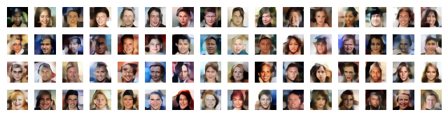
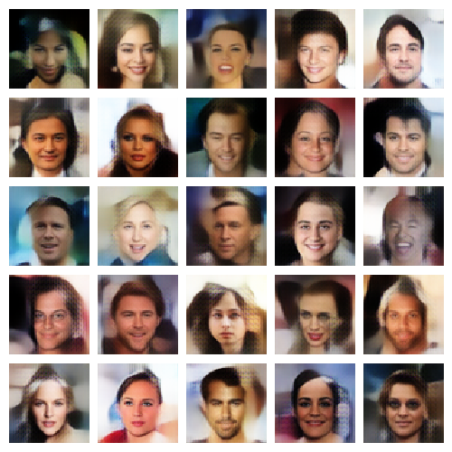
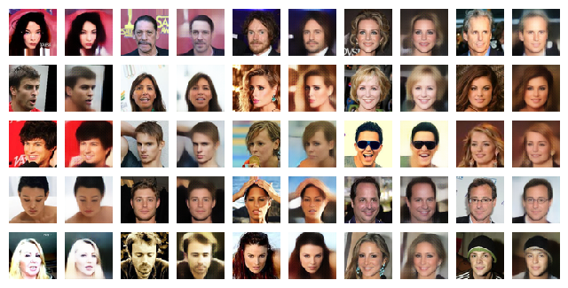
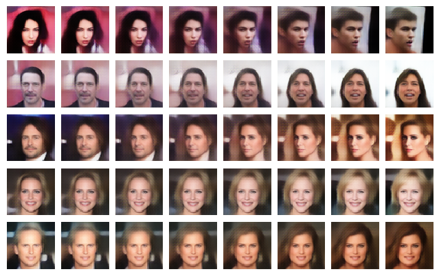

# Discriminative Regularization for Generative Models



Code for the [Discriminative Regularization for Generative Models](http://arxiv.org/abs/1602.03220)
paper.

## Requirements

* [Blocks](https://blocks.readthedocs.org/en/latest/), development version
* [Fuel](https://fuel.readthedocs.org/en/latest/), development version

## Downloading and converting the datasets

Set up your `~/.fuelrc` file:

``` bash
$ echo "data_path: \"<MY_DATA_PATH>\"" > ~/.fuelrc
```

Go to `<MY_DATA_PATH>`:

``` bash
$ cd <MY_DATA_PATH>
```

Download the SVHN format 2 dataset:

``` bash
$ fuel-download svhn 2
$ fuel-convert svhn 2
$ fuel-download svhn 2 --clear
```

Download the CIFAR-10 dataset:

``` bash
$ fuel-download cifar10
$ fuel-convert cifar10
$ fuel-download cifar10 --clear
```

Download the CelebA dataset:

``` bash
$ fuel-download celeba
$ fuel-convert celeba 64
$ fuel-download celeba --clear
```

## Training the models

Make sure you're in the repo's root directory.

### Download VGG19

Required for the SVHN and CIFAR10 models.

``` bash
python scripts/download_vgg19
```

### SVHN

Make sure you downloaded VGG19.

**The SVHN experiment code will be published very soon.**

### CIFAR-10

Make sure you downloaded VGG19.

**The CIFAR-10 experiment code will be published very soon.**

### CelebA

Train the CelebA classifier:

``` bash
$ THEANORC=theanorc python experiments/train_celeba_classifier.py
```

Train a VAE *without* discriminative regularization:

``` bash
$ THEANORC=theanorc python experiments/train_celeba_vae.py
```

Train a VAE *with* discriminative regularization:

``` bash
$ THEANORC=theanorc python experiments/train_celeba_vae.py --regularize
```

Fine-tune the trained model:

``` bash
$ THEANORC=theanorc scripts/adjust_population_statistics [trained_model.zip] [save_path.zip]
```

e.g.

``` bash
$ THEANORC=theanorc scripts/adjust_population_statistics \
  celeba_vae_regularization.zip celeba_vae_regularization_adjusted.zip
```

Note: If you run out of memory in training, a good workaround is to reduce the
`training_batch_size` and `monitoring_batch_size`.

## Evaluating the models

### Samples

``` bash
$ THEANORC=theanorc scripts/sample [trained_model.zip]
```

e.g.

``` bash
$ THEANORC=theanorc scripts/sample celeba_vae_regularization_adjusted.zip
```



### Reconstructions

``` bash
$ THEANORC=theanorc scripts/reconstruct [which_dataset] [trained_model.zip]
```

e.g.

``` bash
$ THEANORC=theanorc scripts/reconstruct celeba celeba_vae_regularization_adjusted.zip
```



### Interpolations

``` bash
$ THEANORC=theanorc scripts/interpolate [which_dataset] [trained_model.zip]
```

e.g.

``` bash
$ THEANORC=theanorc scripts/interpolate celeba celeba_vae_regularization_adjusted.zip
```



Note: All evaluation scripts use ipython. But this behavior can be overridden by explicitly using python on the command line along with a save path. For example:

```
THEANORC=theanorc python scripts/sample --save-path sample_no_reg.png celeba_vae_no_regularization.zip
```

### NLL approximation

``` bash
$ THEANORC=theanorc scripts/compute_nll_approximation [which_dataset] [trained_model.zip]
```

*Note: this takes a __long__ time.*
